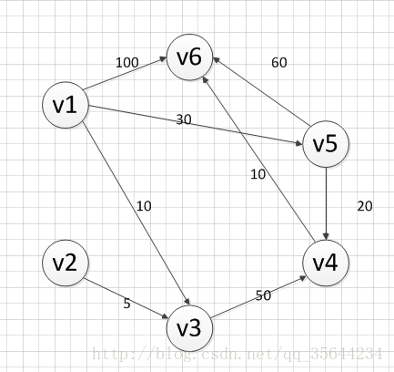

# Difference of A* & Dijkstra

tag : *Algorithm*

author : gzy

---

最短路径搜索，给定了一张地图，已知起始点和目标点，求两点间的最短路径。大家比较常听到的有A*算法和 Dijkstra算法。

具体就不用多说，算法比较简单，可以看一下网上的博客（见拓展），30min就可以了解算法是如何运行的。网上也有很多开源代码，ROS也有具体的包实现。

## 算法差别
但是同样是找最短路径，这两种算法有什么不同？这是我主要的疑惑点。我是这么找到答案的。

首先，我知道ROS Navigation Stack之前用到了轨迹规划的包叫做Navfn，看网上评论大家似乎用的比较顺手。看了[Navfn的官网](http://wiki.ros.org/navfn)，支持Dijkstra但是不支持A* 。我觉得[这个回答](https://answers.ros.org/question/28366/why-navfn-is-using-dijkstra/?answer=28399#post-id-28399)可以接受，但是具体性能如何，还要根据实际情况判断，比较A*的性能和启发函数相关，不能一概而论。

## 被搜索图的差别
另一个疑惑点是，这两个算法使用的map不太一样。A* 使用的是网格图，每个网格代表一个位置，在简介中，网格不带cost，在网格间移动会产生cost。而Dijkstra使用的是“图”数据结构，每个顶点是一个位置，沿着边移动会产生cost。

使用A*搜索的 **网格图**

使用Dijkstra搜索的 **图**

但是仔细一想，这两种地图可以相互转化的。如果要进行图搜索，那A* 用的**网格图**可以转化为**图**，只需要把每个网格变成图的顶点，相邻网格之间连上cost为1的边即可；如果要在**网格图**里进行路径搜索，Dijkstra使用的**图**也可以具体化为**网格图**的，只需要让每个顶点的度变成4，每个边的移动cost变成1就相当于**网格图**了。

## 算法和实际ROS实现的差别
但是再仔细一想，还是有点不太对劲，即使沿路移动的cost被计算进去了，但实际ROS中，对环境感知后得到的cost map却比这个还要多一个东西，就是每一个点上的cost。不仅沿着路移动会有cost，进入下一个点cost也会产生cost。这个是合理的，因为有的点是障碍物，cost极大，虽然向那个点移动可能不花费cost，算是踩到那个点相当于撞墙，所以cost极大，这可以帮助机器人避开不合理的点。

所以ROS对上述算法是实现中还做了一个小改动，就是将移动的cost和将要踩到的下一点的cost融合成为一个叫做potential的值，利用这个potential进行排序选择真正的下一点。

## 拓展
[Dijkstra算法详解](https://blog.csdn.net/qq_35644234/article/details/60870719)，虽然写的并不太好，不失为快速了解的好方法

[A*](https://www.cnblogs.com/zhoug2020/p/3468167.html)，一个有趣又简单的举例解释。

只有Dijkstra的[navfn](http://wiki.ros.org/navfn)已经不多用了，现在用的更多的是实现了A*和Dijkstra的ROS包[global_planner](http://wiki.ros.org/global_planner)

