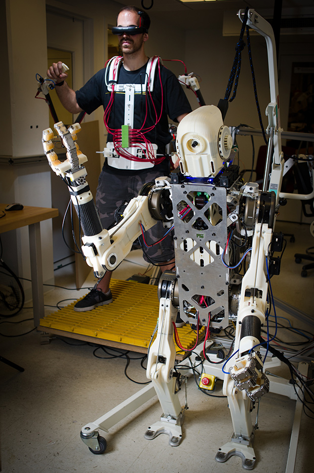
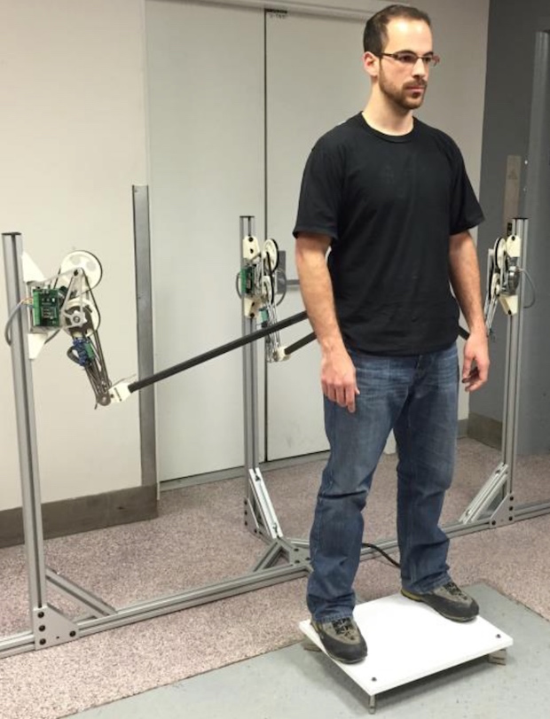

# HERMES 遥操作机器人

tag: *MIT* *BioMimetic Robotics Lab* *双足*

---

## 硬件
- 成年人的9成高
- 24 DoF
- 45kg
- *high-torque-density electric actuator*,该实验室还做高能量密度的电机，正好用于Hermes。这款电机动态性高，瞬时输出功率大。因此hermes可以做非常暴力的“击穿木板”的动作。
- 自己开发的基于数传的视觉反馈系统
- 自己开发的带*躯干姿态反馈*的遥操作系统（可以从demo视频看到身体的倾斜会施加给操纵者）
- 全是自己开发的好强…感觉全是2个PhD的工作量

## 应用场景

Balance Feedback Interface(BFI)

> This strategy means that if the robot is about to lose balance, then the BFI attempts to pull the human out of balance as well. In this case, we hypothesize that the BFI is to trigger human’s natural response to disturbances.

这是设想的机器人平衡方式，通过机器人身上的传感器反馈来拉扯人，使人也产生相同的不平衡。复制人所做出的自然反应施加给机器人，使机器人保持平衡。这也就是标题所说的

> MIT Robot Steals Human Brains to Help It Balance

然而这一功能还在开发，希望将其完善到6DoF的全面反馈。

目前机器人还不能行走，可以进行遥操作击穿木板，拿斧头劈门，拿灭火器灭火这样的工作。

## 链接
[MIT 官方 demo](https://www.youtube.com/watch?time_continue=160&v=2-5n2IsdCqU)

[官方介绍视频](https://www.youtube.com/watch?time_continue=196&v=p8ozov_xymM)

J. Ramos, A. Wang, and S. Kim, "Robot-Human Balance State Transfer during Full-Body Humanoid Teleoperation Using Divergent Component of Motion Dynamics" in Robotics and Automation (ICRA), 2016 IEEE International Conference on. IEEE, 2016.